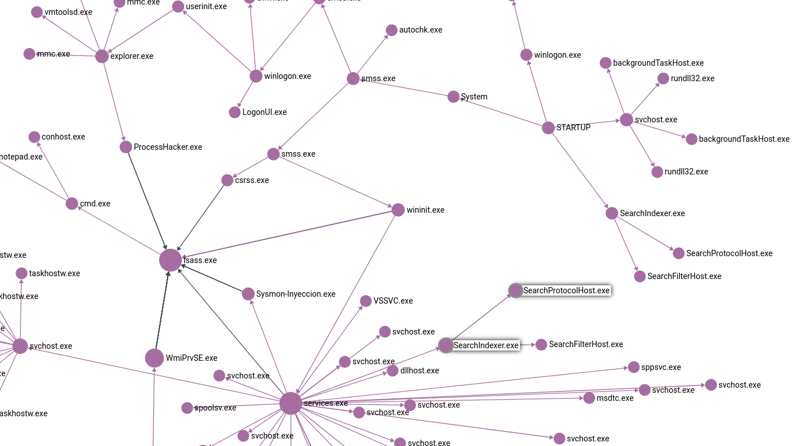

# sysmon-arangodb
Threat hunting with Sysmon and ArangoDB Graphs

Start database:
```
docker run -p 8529:8529 -e ARANGO_ROOT_PASSWORD=openSesame arangodb/arangodb:3.6.2
```

EVTX Logs: https://github.com/lab52io/Syspce/tree/master/Evtx
From evtx to jsonl using **evtx** parser (https://github.com/omerbenamram/evtx)

With that we can process all our logs:
```
python3 arango_from_evtx.py
```



Simple query to detect a process started by *explorer.exe* (manually executed) that acces other process (EventID=10).
```
FOR startProcess IN SysmonProcess
    FILTER startProcess.Image == "C:\\Windows\\explorer.exe"
    FOR vertex, edge IN 1..4 OUTBOUND startProcess CreateNewProcess
        FOR evil, evilEdge IN 1 OUTBOUND vertex ProcessAccessed
            RETURN {
                "from" : vertex,
                "to" : evil,
                "condition" : evilEdge
            }
```

Result:
```json
[
  {
    "from": {
      "_key": "1258",
      "_id": "SysmonProcess/1258",
      "_rev": "_aWOCMem---",
      "_name": "ProcessHacker.exe",
      "Image": "C:\\Users\\pula\\Desktop\\processhacker-2.36-bin\\x86\\ProcessHacker.exe",
      "ProcessId": 4852,
      "ProcessGuid": "21207A7E-6EED-5D77-0000-0010EF6E0A00",
      "User": "DESKTOP-CF2FLGA\\pula",
      "ProcessName": "ProcessHacker.exe",
      "LogonGuid": "21207A7E-6ECA-5D77-0000-0020885A0700",
      "Computer": "DESKTOP-CF2FLGA"
    },
    "to": {
      "_key": "551",
      "_id": "SysmonProcess/551",
      "_rev": "_aWOCLsC---",
      "_name": "lsass.exe",
      "Image": "C:\\Windows\\System32\\lsass.exe",
      "ProcessId": 748,
      "ProcessGuid": "21207A7E-6EBA-5D77-0000-00109C970000",
      "User": "NT AUTHORITY\\SYSTEM",
      "ProcessName": "lsass.exe",
      "LogonGuid": "21207A7E-6EBA-5D77-0000-0020E7030000",
      "Computer": "DESKTOP-CF2FLGA"
    },
    "condition": {
      "_key": "1267",
      "_id": "ProcessAccessed/1267",
      "_from": "SysmonProcess/1258",
      "_to": "SysmonProcess/551",
      "_rev": "_aWOCMfO---",
      "_name": "C:\\Windows\\SYSTEM32\\ntdll.dll+831ea|C:\\Users\\pula\\Desktop\\processhacker-2.36-bin\\x86\\ProcessHacker.exe+182af|C:\\Users\\pula\\Desktop\\processhacker-2.36-bin\\x86\\ProcessHacker.exe+86139|C:\\Users\\pula\\Desktop\\processhacker-2.36-bin\\x86\\ProcessHacker.exe+87da9|C:\\Users\\pula\\Desktop\\processhacker-2.36-bin\\x86\\ProcessHacker.exe+1e439|C:\\Users\\pula\\Desktop\\processhacker-2.36-bin\\x86\\ProcessHacker.exe+1167|C:\\Windows\\system32\\KERNEL32.DLL+1dea4|C:\\Windows\\SYSTEM32\\ntdll.dll+505ae|C:\\Windows\\SYSTEM32\\ntdll.dll+5057d",
      "UtcTime": "2019-09-10 09:37:50.058",
      "EventRecordID": 14280,
      "User": "S-1-5-18",
      "CallTrace": "C:\\Windows\\SYSTEM32\\ntdll.dll+831ea|C:\\Users\\pula\\Desktop\\processhacker-2.36-bin\\x86\\ProcessHacker.exe+182af|C:\\Users\\pula\\Desktop\\processhacker-2.36-bin\\x86\\ProcessHacker.exe+86139|C:\\Users\\pula\\Desktop\\processhacker-2.36-bin\\x86\\ProcessHacker.exe+87da9|C:\\Users\\pula\\Desktop\\processhacker-2.36-bin\\x86\\ProcessHacker.exe+1e439|C:\\Users\\pula\\Desktop\\processhacker-2.36-bin\\x86\\ProcessHacker.exe+1167|C:\\Windows\\system32\\KERNEL32.DLL+1dea4|C:\\Windows\\SYSTEM32\\ntdll.dll+505ae|C:\\Windows\\SYSTEM32\\ntdll.dll+5057d",
      "TargetImage": "",
      "Computer": "DESKTOP-CF2FLGA"
    }
  },
  {
    "from": {
      "_key": "1258",
      "_id": "SysmonProcess/1258",
      "_rev": "_aWOCMem---",
      "_name": "ProcessHacker.exe",
      "Image": "C:\\Users\\pula\\Desktop\\processhacker-2.36-bin\\x86\\ProcessHacker.exe",
      "ProcessId": 4852,
      "ProcessGuid": "21207A7E-6EED-5D77-0000-0010EF6E0A00",
      "User": "DESKTOP-CF2FLGA\\pula",
      "ProcessName": "ProcessHacker.exe",
      "LogonGuid": "21207A7E-6ECA-5D77-0000-0020885A0700",
      "Computer": "DESKTOP-CF2FLGA"
    },
    "to": {
      "_key": "551",
      "_id": "SysmonProcess/551",
      "_rev": "_aWOCLsC---",
      "_name": "lsass.exe",
      "Image": "C:\\Windows\\System32\\lsass.exe",
      "ProcessId": 748,
      "ProcessGuid": "21207A7E-6EBA-5D77-0000-00109C970000",
      "User": "NT AUTHORITY\\SYSTEM",
      "ProcessName": "lsass.exe",
      "LogonGuid": "21207A7E-6EBA-5D77-0000-0020E7030000",
      "Computer": "DESKTOP-CF2FLGA"
    },
    "condition": {
      "_key": "1271",
      "_id": "ProcessAccessed/1271",
      "_from": "SysmonProcess/1258",
      "_to": "SysmonProcess/551",
      "_rev": "_aWOCMfi---",
      "_name": "C:\\Windows\\SYSTEM32\\ntdll.dll+831ea|C:\\Users\\pula\\Desktop\\processhacker-2.36-bin\\x86\\ProcessHacker.exe+182af|C:\\Users\\pula\\Desktop\\processhacker-2.36-bin\\x86\\ProcessHacker.exe+88900|C:\\Users\\pula\\Desktop\\processhacker-2.36-bin\\x86\\ProcessHacker.exe+1e439|C:\\Users\\pula\\Desktop\\processhacker-2.36-bin\\x86\\ProcessHacker.exe+1167|C:\\Windows\\system32\\KERNEL32.DLL+1dea4|C:\\Windows\\SYSTEM32\\ntdll.dll+505ae|C:\\Windows\\SYSTEM32\\ntdll.dll+5057d",
      "UtcTime": "2019-09-10 09:37:50.058",
      "EventRecordID": 14281,
      "User": "S-1-5-18",
      "CallTrace": "C:\\Windows\\SYSTEM32\\ntdll.dll+831ea|C:\\Users\\pula\\Desktop\\processhacker-2.36-bin\\x86\\ProcessHacker.exe+182af|C:\\Users\\pula\\Desktop\\processhacker-2.36-bin\\x86\\ProcessHacker.exe+88900|C:\\Users\\pula\\Desktop\\processhacker-2.36-bin\\x86\\ProcessHacker.exe+1e439|C:\\Users\\pula\\Desktop\\processhacker-2.36-bin\\x86\\ProcessHacker.exe+1167|C:\\Windows\\system32\\KERNEL32.DLL+1dea4|C:\\Windows\\SYSTEM32\\ntdll.dll+505ae|C:\\Windows\\SYSTEM32\\ntdll.dll+5057d",
      "TargetImage": "",
      "Computer": "DESKTOP-CF2FLGA"
    }
  },
  {
    "from": {
      "_key": "1258",
      "_id": "SysmonProcess/1258",
      "_rev": "_aWOCMem---",
      "_name": "ProcessHacker.exe",
      "Image": "C:\\Users\\pula\\Desktop\\processhacker-2.36-bin\\x86\\ProcessHacker.exe",
      "ProcessId": 4852,
      "ProcessGuid": "21207A7E-6EED-5D77-0000-0010EF6E0A00",
      "User": "DESKTOP-CF2FLGA\\pula",
      "ProcessName": "ProcessHacker.exe",
      "LogonGuid": "21207A7E-6ECA-5D77-0000-0020885A0700",
      "Computer": "DESKTOP-CF2FLGA"
    },
    "to": {
      "_key": "551",
      "_id": "SysmonProcess/551",
      "_rev": "_aWOCLsC---",
      "_name": "lsass.exe",
      "Image": "C:\\Windows\\System32\\lsass.exe",
      "ProcessId": 748,
      "ProcessGuid": "21207A7E-6EBA-5D77-0000-00109C970000",
      "User": "NT AUTHORITY\\SYSTEM",
      "ProcessName": "lsass.exe",
      "LogonGuid": "21207A7E-6EBA-5D77-0000-0020E7030000",
      "Computer": "DESKTOP-CF2FLGA"
    },
    "condition": {
      "_key": "1275",
      "_id": "ProcessAccessed/1275",
      "_from": "SysmonProcess/1258",
      "_to": "SysmonProcess/551",
      "_rev": "_aWOCMfy---",
      "_name": "C:\\Windows\\SYSTEM32\\ntdll.dll+831ea|C:\\Users\\pula\\Desktop\\processhacker-2.36-bin\\x86\\ProcessHacker.exe+182af|C:\\Users\\pula\\Desktop\\processhacker-2.36-bin\\x86\\ProcessHacker.exe+85a25|C:\\Users\\pula\\Desktop\\processhacker-2.36-bin\\x86\\ProcessHacker.exe+85ee7|C:\\Users\\pula\\Desktop\\processhacker-2.36-bin\\x86\\ProcessHacker.exe+328ae|C:\\Users\\pula\\Desktop\\processhacker-2.36-bin\\x86\\ProcessHacker.exe+1167|C:\\Windows\\system32\\KERNEL32.DLL+1dea4|C:\\Windows\\SYSTEM32\\ntdll.dll+505ae|C:\\Windows\\SYSTEM32\\ntdll.dll+5057d",
      "UtcTime": "2019-09-10 09:37:50.089",
      "EventRecordID": 14282,
      "User": "S-1-5-18",
      "CallTrace": "C:\\Windows\\SYSTEM32\\ntdll.dll+831ea|C:\\Users\\pula\\Desktop\\processhacker-2.36-bin\\x86\\ProcessHacker.exe+182af|C:\\Users\\pula\\Desktop\\processhacker-2.36-bin\\x86\\ProcessHacker.exe+85a25|C:\\Users\\pula\\Desktop\\processhacker-2.36-bin\\x86\\ProcessHacker.exe+85ee7|C:\\Users\\pula\\Desktop\\processhacker-2.36-bin\\x86\\ProcessHacker.exe+328ae|C:\\Users\\pula\\Desktop\\processhacker-2.36-bin\\x86\\ProcessHacker.exe+1167|C:\\Windows\\system32\\KERNEL32.DLL+1dea4|C:\\Windows\\SYSTEM32\\ntdll.dll+505ae|C:\\Windows\\SYSTEM32\\ntdll.dll+5057d",
      "TargetImage": "",
      "Computer": "DESKTOP-CF2FLGA"
    }
  },
  {
    "from": {
      "_key": "1258",
      "_id": "SysmonProcess/1258",
      "_rev": "_aWOCMem---",
      "_name": "ProcessHacker.exe",
      "Image": "C:\\Users\\pula\\Desktop\\processhacker-2.36-bin\\x86\\ProcessHacker.exe",
      "ProcessId": 4852,
      "ProcessGuid": "21207A7E-6EED-5D77-0000-0010EF6E0A00",
      "User": "DESKTOP-CF2FLGA\\pula",
      "ProcessName": "ProcessHacker.exe",
      "LogonGuid": "21207A7E-6ECA-5D77-0000-0020885A0700",
      "Computer": "DESKTOP-CF2FLGA"
    },
    "to": {
      "_key": "551",
      "_id": "SysmonProcess/551",
      "_rev": "_aWOCLsC---",
      "_name": "lsass.exe",
      "Image": "C:\\Windows\\System32\\lsass.exe",
      "ProcessId": 748,
      "ProcessGuid": "21207A7E-6EBA-5D77-0000-00109C970000",
      "User": "NT AUTHORITY\\SYSTEM",
      "ProcessName": "lsass.exe",
      "LogonGuid": "21207A7E-6EBA-5D77-0000-0020E7030000",
      "Computer": "DESKTOP-CF2FLGA"
    },
    "condition": {
      "_key": "1279",
      "_id": "ProcessAccessed/1279",
      "_from": "SysmonProcess/1258",
      "_to": "SysmonProcess/551",
      "_rev": "_aWOCMgC---",
      "_name": "C:\\Windows\\SYSTEM32\\ntdll.dll+831ea|C:\\Users\\pula\\Desktop\\processhacker-2.36-bin\\x86\\ProcessHacker.exe+182af|C:\\Users\\pula\\Desktop\\processhacker-2.36-bin\\x86\\ProcessHacker.exe+85ad6|C:\\Users\\pula\\Desktop\\processhacker-2.36-bin\\x86\\ProcessHacker.exe+85ee7|C:\\Users\\pula\\Desktop\\processhacker-2.36-bin\\x86\\ProcessHacker.exe+328ae|C:\\Users\\pula\\Desktop\\processhacker-2.36-bin\\x86\\ProcessHacker.exe+1167|C:\\Windows\\system32\\KERNEL32.DLL+1dea4|C:\\Windows\\SYSTEM32\\ntdll.dll+505ae|C:\\Windows\\SYSTEM32\\ntdll.dll+5057d",
      "UtcTime": "2019-09-10 09:37:50.104",
      "EventRecordID": 14283,
      "User": "S-1-5-18",
      "CallTrace": "C:\\Windows\\SYSTEM32\\ntdll.dll+831ea|C:\\Users\\pula\\Desktop\\processhacker-2.36-bin\\x86\\ProcessHacker.exe+182af|C:\\Users\\pula\\Desktop\\processhacker-2.36-bin\\x86\\ProcessHacker.exe+85ad6|C:\\Users\\pula\\Desktop\\processhacker-2.36-bin\\x86\\ProcessHacker.exe+85ee7|C:\\Users\\pula\\Desktop\\processhacker-2.36-bin\\x86\\ProcessHacker.exe+328ae|C:\\Users\\pula\\Desktop\\processhacker-2.36-bin\\x86\\ProcessHacker.exe+1167|C:\\Windows\\system32\\KERNEL32.DLL+1dea4|C:\\Windows\\SYSTEM32\\ntdll.dll+505ae|C:\\Windows\\SYSTEM32\\ntdll.dll+5057d",
      "TargetImage": "",
      "Computer": "DESKTOP-CF2FLGA"
    }
  }
]
```